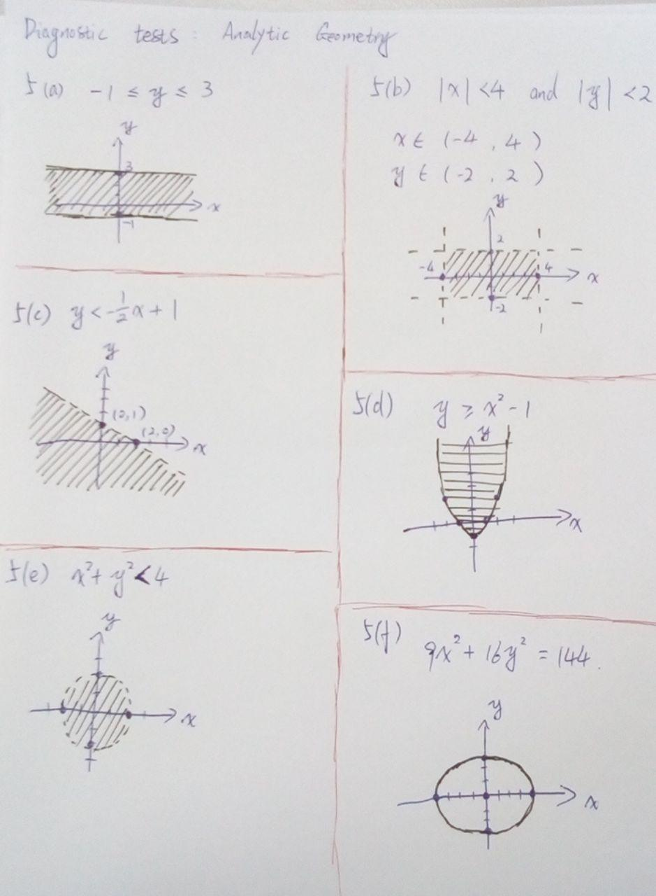

# DIAGNOSTIC TESTS - Analytic Geometry

## 1
<ol type="a">
  <li></li> 
  <li></li> 
  <li></li> 
  <li></li>
</ol>

## 2

* 

## 3

* 

## 4
<ol type="a">
  <li></li> 
  <li></li> 
  <li></li> 
  <li></li> 
  <li></li> 
  <li></li>
</ol>

## 5

* 

<ol type="a">
  <li></li> 
  <li></li> 
  <li></li> 
  <li></li> 
  <li></li> 
  <li></li>
</ol>

<!---

## TODO
<ol type="a">
  <li></li> 
  <li></li>
</ol>

<li></li> 

<li></li> 

%5C%20%7B%5Ccolor%7Bred%7D%28Incorrect%29%7D

\ {\color{red}Incorrect}

--->
