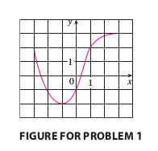

# Trouble questions

## Algebra

### Simplify each expression. Write your answer without negative exponents.

* 2c

  

### Factor each expression.

* 4d

  

### Solve the equation. (Find only the real solutions.)

* 8e

  

* 8f

  

### Solve each inequality. Write your answer using interval notation.

* 9c

  

* 9e

  

## Functions

### Below is the graph of a function f

* 1c: **For what values of x is f(x)=2?**

* 1d: **Estimate the values of x such that f(x)=0.**

### Find the domain of the functions

* 3c

  

---

# Answers to Trouble questions

<strong>Algebra</strong>

* 2c

  

* 4d

  

* 8e

  

* 8f

  

* 9c

  

* 9e

  ![(-1,4\]](https://latex.codecogs.com/gif.latex?%28-1%2C4%5D)

<strong>Functions</strong>

* 1c

  

* 1d

  

* 3c

  

