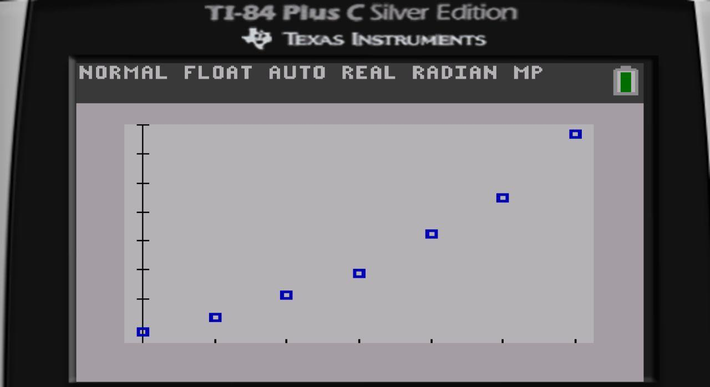
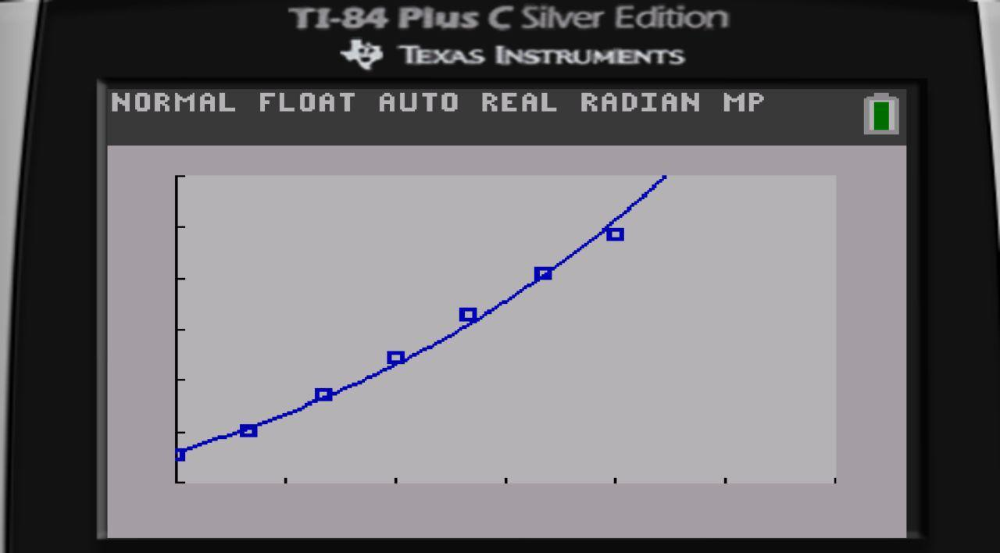
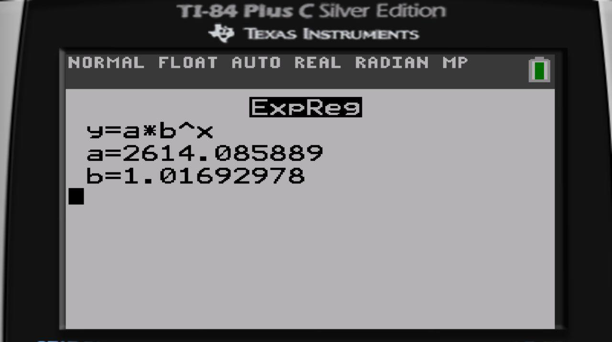

# 1.2 Exercies

## 23
<ol type="a">
  <li></li> 
  <li></li> 
  <li></li> 
  <li></li> 
  <li></li>
</ol>

## 25
<ol type="a">
  <li></li> 
  <li></li> 
  <li></li>
</ol>

## 27
<ol type="a">
  <li></li> 
  <li></li> 
  <li></li>
</ol>

## 31
<ol type="a">
  <li></li> 
  <li></li>
</ol>

# 1.3 Exercies
 
## 5

 
## 9,13,17,21

 
## 29

 
## 59

# 1.4 Exercises

## 7

## 9

## 11,13,15

## 27

## 29
<ol type="a">
  <li></li> 
  <li></li> 
  <li></li>
</ol>

## 31d

## 35
<ol type="a">
  <li></li> 
  <li></li> 
  <li></li>
</ol>

## 37

