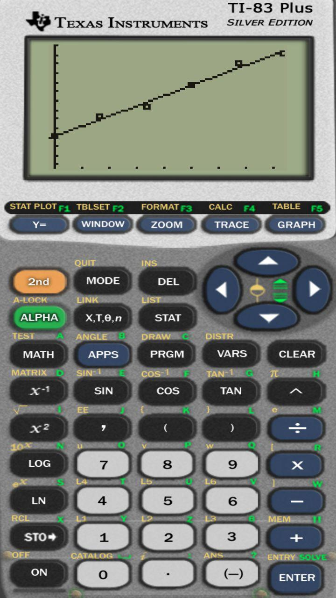

# 1.2 Exercies

## 23
<ol type="a">
  <li></li> 
  <li></li> 
  <li></li> 
  <li></li> 
  <li></li>
</ol>

## 25
<ol type="a">
  <li></li> 
  <li></li> 
  <li></li>
</ol>

## 27
<ol type="a">
  <li></li> 
  <li></li> 
  <li></li>
</ol>

## 31
<ol type="a">
  <li></li> 
  <li></li>
</ol>
