# Trouble questions

## 1.1 Exercise

### 3(e)

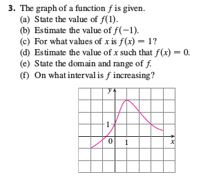

### 9

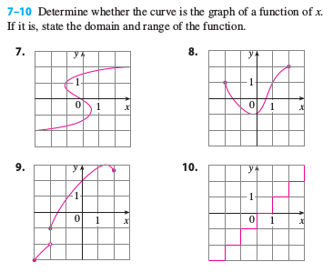

### 13

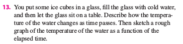

### 21

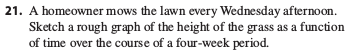

### 25

* Find f(a+1)

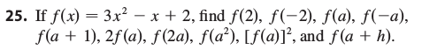

### 35, 37

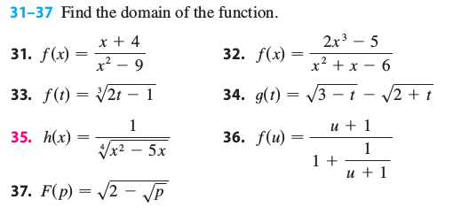

### 43

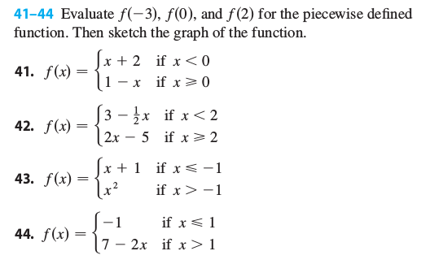

## 1.2 Exercise

### 5

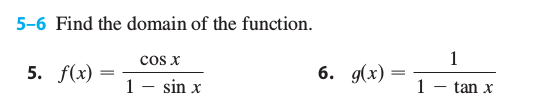

### 7(b)

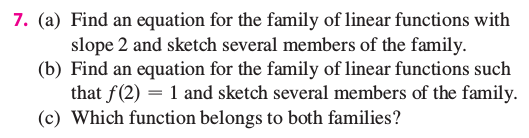

## 1.3 Exercise

### 1(e,f)

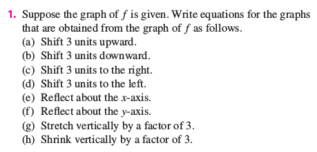

### 5(a,b)

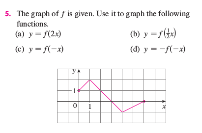

### 21

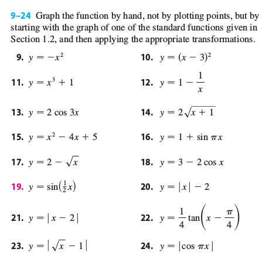

## 1.4 Exercise

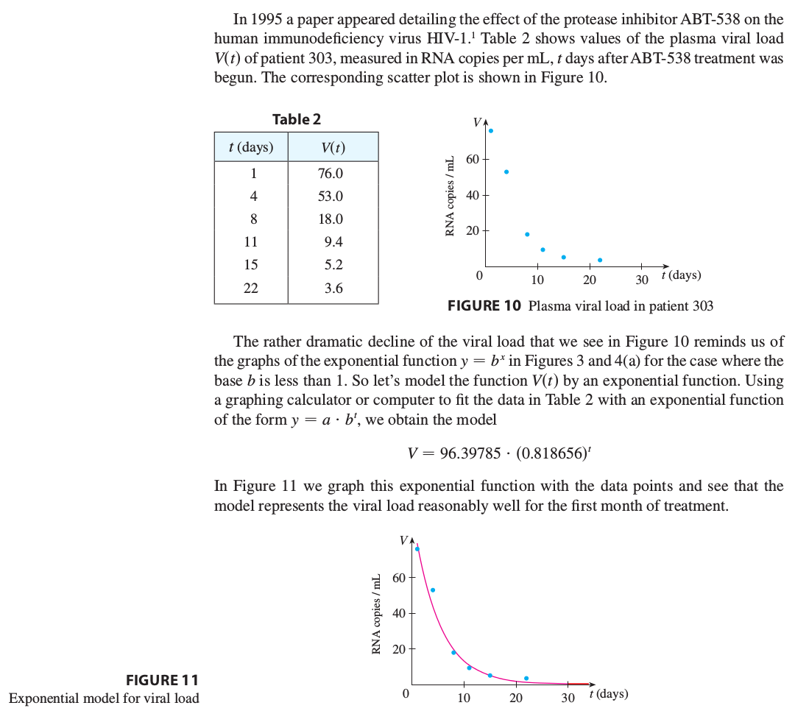
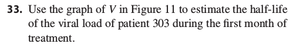

---

# Answers to Trouble questions

<strong>1.1 Exercises</strong>

* 3e

  TODO

* 9

  TODO

* 13

  TODO

* 21

  TODO

* 25

  TODO

* 35

  TODO

* 37

  TODO

* 43

  TODO

<strong>1.2 Exercises</strong>

* 5

  TODO

* 7b

  TODO

<strong>1.3 Exercises</strong>

* 1e,1f

  TODO

* 5a,5b

  TODO

* 21

  TODO

<strong>1.4 Exercises</strong>

* 33

  TODO

